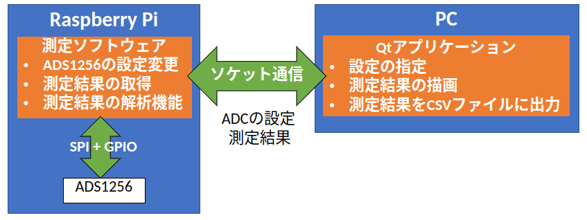

# Raspberry Piと高精度ADCを使用した測定システムの構築

アナログデバイセズ社の24bitΔΣ型ADCのADS1256とRaspberry Piを使用した直流電圧計と周波数解析機能を実装する。 
開発はUbuntu22.04で行ったが、その他の環境でも構築可能である。 
システムはPC側とRaspberry Pi側の2つのプログラムで構成される。 
Raspberry Pi側ではADS1256から測定値の取得及び周波数解析を行い、PC側では測定結果をグラフに描画、測定結果をCSVファイルにプロットするなどを行う。

[PC側アプリケーション](https://github.com/uriu-make/High-reso-ADC-qt)

[Raspberry Pi側アプリケーション](https://github.com/uriu-make/High-resolution-ADC-dev)

## システム概要
Raspberry PiでADS1256を操作し、電圧を読み取る。PCとはソケット通信を使用して測定の条件の指定と測定データとを送受信する。測定は電圧の読み取りとダウンサンプリングを行った上でのFFTの2つを行うことができる。 
Raspberry Pi側のプログラムで測定を完結させた理由は、データロガーとしての使用を考慮したためである。 
Raspberry Piの設定は`setup.sh`を実行することで完了する。

    

## プロトコル
PCとRaspberry Piはソケット通信を使用する。通信では構造体を使用している。 
設定を送信する構造体は以下の通り
~~~cpp
struct COMMAND {
  uint8_t rate;     //測定間隔
  uint8_t gain;     //PGA
  uint8_t positive; //正入力
  uint8_t negative; //負入力
  uint8_t buf;      //アナログバッファの有効化/無効化
  uint8_t sync;     //同期を取る機能の有効化/無効化
  uint8_t mode;     //通常の測定かFFTかの選択
  uint8_t run;      //測定開始/停止
  uint8_t kill = 0; //プログラムを終了
};
~~~
rate,gain,positive,negativeは`ADS1256.h`で定義されている数値を使用し、modeは0で通常の測定、1でFFTになる。それ以外は0で無効、それ以外で有効となる。

通常の測定で送られるデータは以下のとおりである。
~~~cpp
struct read_data {
  int32_t len;            //有効な要素数
  double volt[SAMPLELEN]; //電圧
  uint64_t t[SAMPLELEN];  //時間
};
~~~
データは固定長の配列に格納され、SAMPLELENは`ADS1256.h`で定義されている。 
Raspberry Piでは等間隔に処理できないため、送信可能なデータ数は不定である。また、測定間隔も最も遅いもので毎秒2.5サンプルのため、データが一定数貯まると送信するなどの方法は使いづらい。そこで、固定長の配列から有効な要素数だけコピーする方法を採用した。

FFTで送られるデータは以下のとおりである。
~~~cpp
struct fft_data {
  double freq_bin;            //周波数ビン
  std::complex<double> F[N];  //FFTの結果
};
~~~
FFTではデータ数が固定であることが自明であるため、そのまま送信される。また、後に逆フーリエ変換をすることを考慮し、複素数のまま送信する。 
freq_binは周波数ビンのことで、FFTが何Hz刻みで測定されているかを示す。